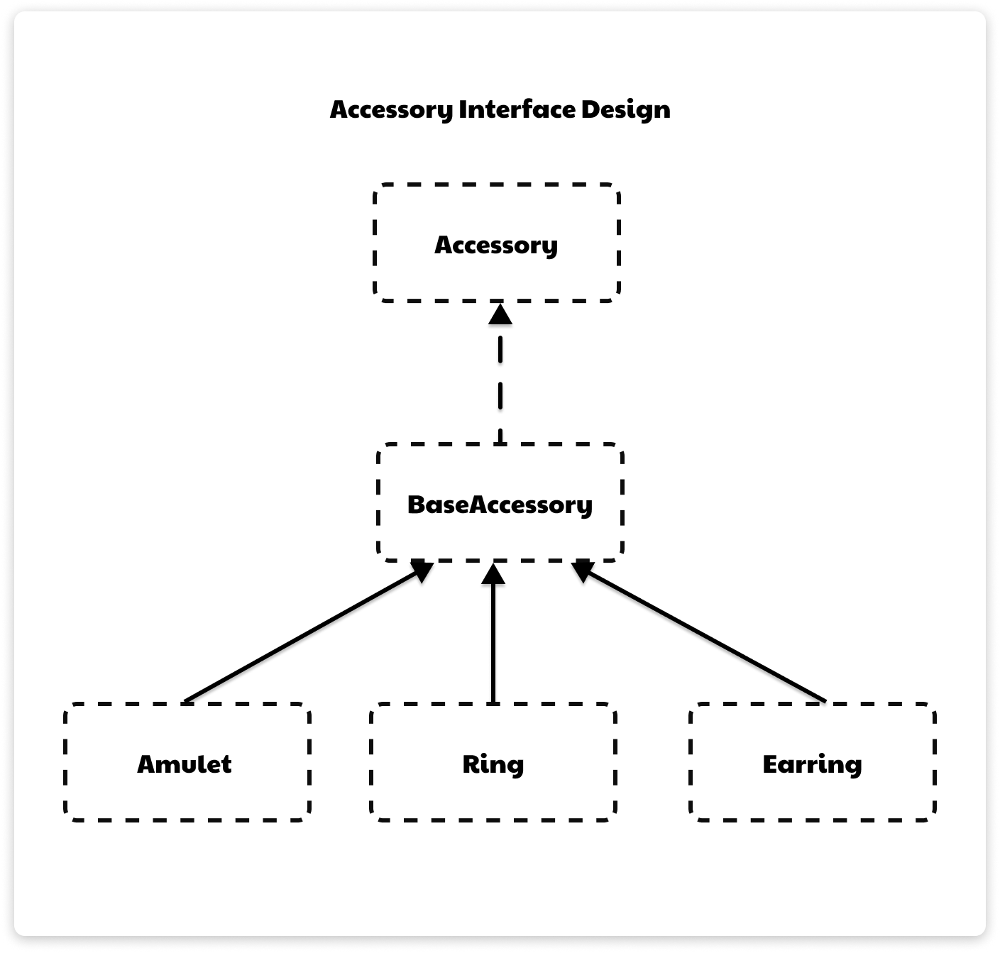

# Accessory Interface

## Interface

### `Accessory`:
- `String getName()`: Get ชื่อของ Accessory
- `String getEffectType()`: Get ประเภทของ effect ของ Accessory
- `int getEffectValue()`: Get ค่าของ effect ของ Accessory
- `default void showStats()`: แสดง ชือ และ effect ของ Accessory
## Abstract Class

### `BaseAccessory` implements `Accessory`:
#### Variables:
- `String name`: ชื่อของ Accessory
- `String effectType`: ประเภทของ effect ของ Accessory
- `int effectValue`: ค่า effect (%) ที่จะมีผลกับ stats ของตัวละคร 

#### Methods:
- `Constructor`: Initialize name, effectType, effectValue
- `String getName()`: Get ชื่อของ Accessory
- `String getEffectType()`: Get ประเภทของ effect ของ Accessory
- `int getEffectValue()`: Get ค่าของ effect ของ Accessory

## Classes

### `Amulet` extends `BaseAccessory`:
- `Constructor`: Initialize ค่า effectType, effectValue super(//effectType, effectValue ที่รับเข้ามา)

### `Ring` extends `BaseAccessory`:
- `Constructor`: Initialize ค่า effectType, effectValue super(//effectType, effectValue ที่รับเข้ามา)

### `Earring` extends `BaseAccessory`:
- `Constructor`: Initialize ค่า effectType, effectValue super(//effectType, effectValue ที่รับเข้ามา)

