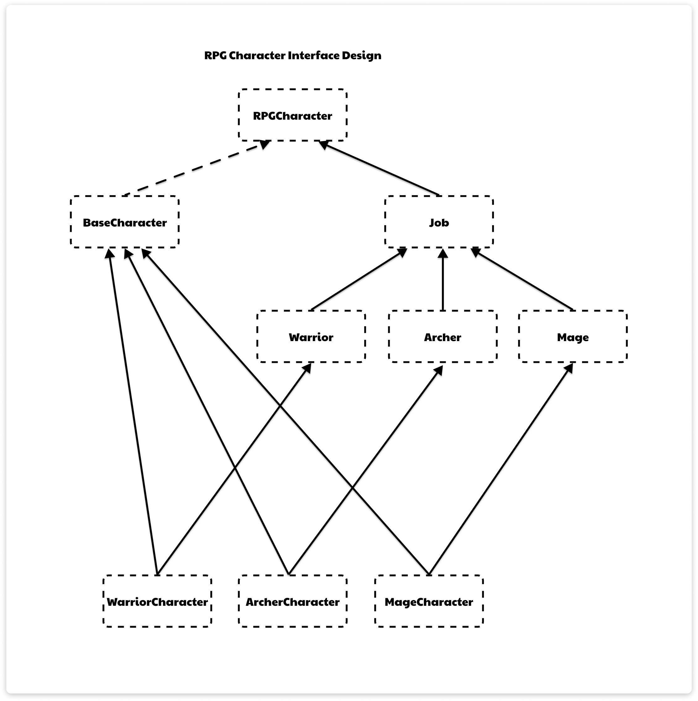

# RPG Character Interface

## Interfaces

### `RPGCharacter`:
- `String getName()`: Get ชื่อตัวละคร
- `int getLevel()`: Get เลเวลตัวละคร
- `String getJobName()`: Get อาชีพตัวละคร
- `void levelUp()`: อัพเลเวลตัวละครทีละ 1 level และอัพเดท stats ใหม่
- `void equipAccessory(Accessory)`: สวมใส่ Accessory กับตัวละคร
- `void equipEquipment(Equipment)`: สวมใส่ Equipment กับตัวละคร
- `Accessory[] getEquippedAccessory()`: Get Accessory ที่ตัวละครสวมใส่อยู่
- `Equipment[] getEquippedEquipment()`: Get Equipment ที่ตัวละครสวมใส่อยู่
- `void showStats()`: Print ค่า Stats ของตัวละคร
- `default void showCharacterInfo()`: Print ค่าของ name, level, Stats, job, accessory และ equipment

### `Job` extends `RPGCharacter`:
- `String getJobName()`: Get อาชีพตัวละคร
- `String[] getAllAbilities()`: Get Ability ทั้งหมดของอาชีพนั้นๆ
- `default void showAllAbilities()`: Print jobName, All Abilities;

### `Warrior` extends `Job`:
- `void slash()`: ใช้ ability Slash ของ Warrior
- `void block()`: ใช้ ability Block ของ Warrior
- `String getJobName()`: Return "Warrior"
- `default String getAllAbilities(int)`: Return Array{Slash, Block}

### `Mage` extends `Job`:
- `void castSpell()`: ใช้ ability Cast Spell ของ Mage
- `void teleport()`: ใช้ ability Teleport ของ Mage
- `String getJobName()`: Return "Mage"
- `default String getAllAbilities(int)`: Return Array{Cast Spell, Teleport}

### `Archer` extends `Job`:
- `void shot()`: ใช้ ability Shot ของ Archer
- `void dodge()`: ใช้ ability Dodge ของ Archer
- `String getJobName()`: Return "Archer"
- `default String getAllAbilities(int)`: Return Array{Shoot, Dodge}

## Abstract Class

### `BaseCharacter` implements `RPGCharacter`:
#### Variables:
- `String name`: ชื่อของตัวละคร
- `int level`: เลเวลของตัวละคร
- `double hp, maxHp, mana, maxMana, baseSpeed, speed, maxSpeed`: Stats ตัวละคร 
- `MainWeapon mainHand`: อาวุธมือหลักที่ตัวละครสวมใส่
- `SubWeapon subHand`: อาวุธรองที่ตัวละครสวมใส่
- `Amulet amulet`: สร้อยคอที่ตัวละครสวมใส่
- `Ring ring`: แหวนที่ตัวละครสวมใส่
- `Earring earring`: ต่างหูที่ตัวละครสวมใส่

#### Methods:
- `Constructor`: Initialize ค่า stats ของตัวละคร
- `void showStats()`: Print ค่า stats ของตัวละคร ณ ปัจจุบัน
- `String getName()`: Get ชื่อตัวละคร
- `int getLevel()`: Get เลเวลตัวละคร
- `void levelUp()`: อัพเลเวลตัวละครเพิ่มขึ้น 1 เลเวล และอัพเดท stats ใหม่
- `void equipAccessory(Accessory)`: สวมใส่ Accessory (amulet/ring/earring) และอัพเดท stats
- `void equipEquipment(Equipment)`: สวมใส่ Equipment (mainHand/subHand) และอัพเดท stats 
- `Accessory[] getEquippedAccessory()`: Get Accessory ที่ตัวละครสวมใส่อยู่ทั้งหมด
- `Equipment[] getEquippedEquipment()`: Get Equipment ที่ตัวละครสวมใส่อยู่ทั้งหมด
## Classes

### `WarriorCharacter` extends `BaseCharacter` implements `Warrior`:
- `Constructor`: Initialize ค่า Stats เริ่มต้นของ Warrior (super(//stats เริ่มต้นของ Warrior))
- `void slash()`: Uses the Slash ability.
- `void block()`: Uses the Block ability.

### `MageCharacter` extends `BaseCharacter` implements `Mage`:
- `Constructor`:  Initialize ค่า Stats เริ่มต้นของ Mage (super(//stats เริ่มต้นของ Mage))
- `void castSpell()`: Uses the Cast Spell ability.
- `void teleport()`: Uses the Teleport ability.

### `ArcherCharacter` extends `BaseCharacter` implements `Archer`:
- `Constructor`: Initialize ค่า Stats เริ่มต้นของ Archer (super(//stats เริ่มต้นของ Archer))
- `void shot()`: ใช้ ability Shot ของ Archer
- `void dodge()`: ใช้ ability Dodge ของ Archer

## Diagram
